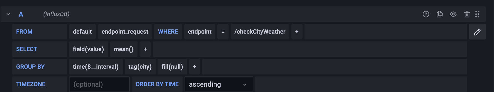

# Influxdb / Telegraf / Grafana - Weather Forcast

- Telegraf: This is an agent that will collect metrics from your application 
- Influxdb: A database where the Telegraf data will be sent
- Grafana: A tool to create monitoring dashboards

Run it with 

    docker-compose up --build

(and omit the build step in future runs unless you change something that requires rebuild)

    docker-compose down

That will switch it off. 

## GRAFANA
Once you enter Grafana via `localhost:3000`, credentials are `admin/admin`. it will force you to change that after first login.

Go to `Configurations -> Data Sources` and add influxdb. after that in the URL add the fallowing: `http://influxdb:8086` and
The database is `metrics`

Notice that the compose file is mounting some local folders in order to have persisting data. Modify those according to your needs. 
